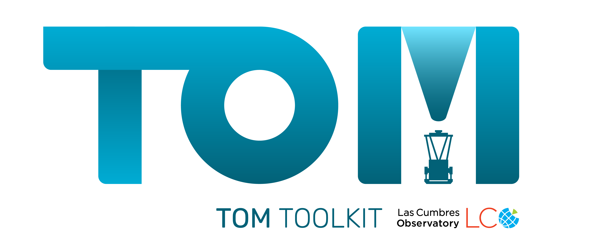

# TOM Toolkit

[Documentation](https://tom-toolkit.readthedocs.io/en/latest/)

The TOM Toolkit is a web framework for building TOMs: Target and Observation
Managers. TOMs are meant to facilitate collaborative astronomical observing
projects. A typical TOM allows it's users to curate target lists, request
observations of those targets at various observatories as well as manage and
organize their data. [Read more](https://tom-toolkit.readthedocs.io/en/latest/about.html) about TOMs.

## Getting started with the TOM Toolkit
The [getting started guide](https://tom-toolkit.readthedocs.io/en/latest/introduction/getting_started.html)
will guide you through the process of setting up a TOM for the first time.

## Reporting issues/feature requests
Please use the [issue tracker](https://github.com/TOMToolkit/tom_base/issues) to
report any issues or support questions.

## Contributing to the project
If you'd like to contribute to the TOM Toolkit, first of all, thanks! Secondly, we
have a [contribution guide](https://tom-toolkit.readthedocs.io/en/latest/contributing.html) that
you might find helpful. We are particularly interested in the contribution of
observation and alert modules.

## Developer information
For development information targeted at the maintainers of the project, please see [README-dev.md](README-dev.md).

## Plugins

### Antares
The [tom-antares](https://github.com/TOMToolkit/tom_antares) plugin adds support
for querying the Antares broker for targets of interest.

### tom-nonsidereal-airmass

The [tom-nonsidereal-airmass](https://github.com/TOMToolkit/tom_nonsidereal_airmass) plugin provides a templatetag
that supports plotting for non-sidereal objects. The plugin is fully supported by the TOM Toolkit team; however,
non-sidereal visibility calculations require the PyEphem library, which is minimally supported while its successor
is in development. The library used for the TOM Toolkit sidereal visibility, astroplan, does not yet support
non-sidereal visibility calculations.

### tom-lt

This module provides the ability to submit observations to the Liverpool Telescope Phase 2 system. It is in a very alpha
state, with little error handling and minimal instrument options, but can successfully submit well-formed observation
requests.

[Github](https://github.com/TOMToolkit/tom_lt)