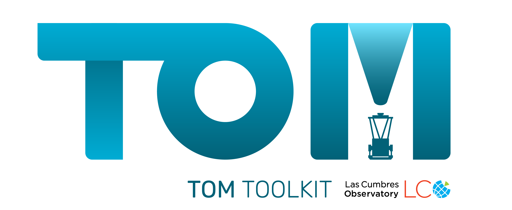

# TOM Toolkit

[Documentation](https://tom-toolkit.readthedocs.io/en/latest/)

The TOM Toolkit is a web framework for building TOMs: Target and Observation
Managers. TOMs are meant to facilitate collaborative astronomical observing
projects. A typical TOM allows its users to curate target lists, request
observations of those targets at various observatories as well as manage and
organize their data. [Read more](https://tom-toolkit.readthedocs.io/en/stable/introduction/about.html) about TOMs.

## Getting started with the TOM Toolkit
The [getting started guide](https://tom-toolkit.readthedocs.io/en/latest/introduction/getting_started.html)
will guide you through the process of setting up a TOM for the first time.

## Reporting issues/feature requests
Please use the [issue tracker](https://github.com/TOMToolkit/tom_base/issues) to
report any issues or support questions.

## Development Team 
The lead developers of the TOM Toolkit are [William Lindstrom](https://lco.global/people/)
and [Joey Chatelain](https://sites.google.com/site/josephchatelain),
professional software developers with the Las Cumbres Observatory software team,
together with [Jon Nation](https://lco.global/people/), [Curtis McCully](https://lco.global/people/),
[Matt Daily](https://lco.global/people/) and [Mark Bowman](https://lco.global/people/).  [Rachel Street](https://lco.global/user/rstreet/) is the project's Principle Investigator.
The TOM Toolkit is grateful for the advice and collaboration with [Andy Howell](http://www.dahowell.com/),
[Edward Gomez](https://www.zemogle.net/), Craig Pellegrino, Jamie Burke and the rest of the LCO Science team.
The [original Toolkit](https://zenodo.org/records/4437764) was developed by
Austin Riba, David Collom and William Lindstrom.

Our team very much welcome input from the community, and we are grateful to
the following people for their many contributions:
 - Dan Avner, NOIRLab
 - Doug Arnold, Liverpool Telescope
 - Etienne Bachelet, IPAC/Caltech
 - Ezequiel Contreras Martinez, UCSB
 - Griffin Hosseinzadeh, University of Arizona
 - Bryan Miller, Gemini Observatory
 - Brendan Mills, UCSB
 - Julien Peloton, Fink

## Acknowledgements

We hope you find our software useful for your research.  If so, we would be grateful
if you can include a brief acknowledgement in your papers and presentations, for example 
"This research made use of [The TOM Toolkit](https://tom-toolkit.readthedocs.io/)". 
We would also very much appreciate you including a citation to our paper describing 
the Toolkit [Street, R.A. et al., 2018, SPIE, 10707, 11](http://adsabs.harvard.edu/abs/2018SPIE10707E..11S) 
(to export the BibTeX please click [here](https://ui.adsabs.harvard.edu/abs/2018SPIE10707E..11S/exportcitation)).  

## Contributing to the project
If you'd like to contribute to the TOM Toolkit, first of all, thanks! Secondly, we
have a [contribution guide](https://tom-toolkit.readthedocs.io/en/stable/introduction/contributing.html) that
you might find helpful. We are particularly interested in the contribution of
observation and alert modules.

### Community Code of Conduct
We encourage developers to maintian a lively and civil discourse either on github or in our slack workspace.
Please review our [code of conduct](CODE_OF_CONDUCT.md) for information about what is considered unacceptable behavior and how to report it.

## Developer information
For development information targeted at the maintainers of the project, please see [README-dev.md](README-dev.md).

## Plugins
Our philosophy is to keep the TOM as lightweight and adaptable as possible.  
Different TOM systems have different science goals and sometimes need 
different functions. Rather than require users to support all 
dependencies from all possible functions, we support a range of optional 
plugin modules for the Toolkit.  Have a look at our [list of plugins](https://tom-toolkit.readthedocs.io/en/stable/api/plugins.html) 
see which would benefit your science goals. 

## About the TOM Toolkit

The TOM Toolkit is managed by Las Cumbres Observatory, with generous
financial support from the [National Science Foundation](https://www.nsf.gov/) grant 2209852.
We are also grateful for support from the [Heising-Simons Foundation](https://hsfoundation.org) 
and the [Zegar Family Foundation](https://sites.google.com/zegarff.org/site) at the start
of the project.  
