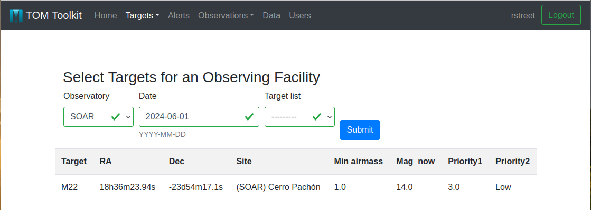
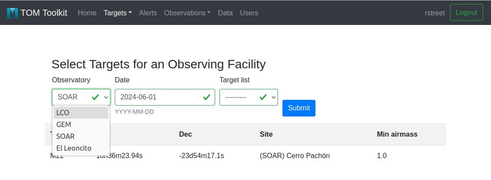

Selecting Targets for an Observing Facility
===========================================

During observing runs, particularly at manually- or remotely-operated telescope
facilities, it can often be very useful to display a selection of targets to be
observed on a particular night.  This needs to take into account target visibiliy from
the telescope site, as well as any prioritization of targets that the team have made.

TOMs provide support for this through the Target Selection option under the Target menu
in the main navigation bar.

.. image:: target_selection_menu_option.png
  :alt: Menu option for Target Selection view

Observers can select the telescope facility that they are observing from using the form
provided, indicating the date of the observing run.  The selected targets can be draw
from a predefined Target Grouping, but if none is specified then targets will be drawn
from all of the targets that the user has permission to see.

The TOM will evaluate the visibility of the selected targets for the telescope on the
night in question, and the resulting table will include all objects with a minimum
airmass less than 2.0.

.. image:: target_selection_table_default.png
  :alt: Default table output for target selection

Customizing the Selected Targets Table
~~~~~~~~~~~~~~~~~~~~~~~~~~~~~~~~~~~~~~

By default, this table will include the essential parameters necessary to point a
telescope at the target, but it can be easily extended to add further information.

The columns of the table can be configured by editing the TOM's ``settings.py`` file.
Additional parameters can be defined for each target by adding dictionary definitions
to the ``EXTRA_FIELDS`` list, as shown in the example below:

.. code-block:: python

    # settings.py
    EXTRA_FIELDS = [
        {'name': 'Mag_now', 'type': 'number'},
        {'name': 'Priority1', 'type': 'number'},
        {'name': 'Priority2', 'type': 'string'}
    ]
    SELECTION_EXTRA_FIELDS = [
        'Mag_now',
        'Priority1',
        'Priority2',
    ]

In this example, we have added ``EXTRA_FIELDS`` named ``Mag_now``, ``Priority1``
and ``Priority2``, which the user can set either by editing each Target's parameters
directly, or programmatically.   Having done so, we can add those ``EXTRA_FIELDS`` to
the target selection table by adding the parameter names to the list of ``SELECTION_EXTRA_FIELDS``.
This produces the table displayed below.

Adding An Observing Facility to the Target Selection Form
~~~~~~~~~~~~~~~~~~~~~~~~~~~~~~~~~~~~~~~~~~~~~~~~~~~~~~~~~

The Target selection form inherits all of the TOM's built-in observing facility classes.
This can be extended to include additional telescopes, including those that are
operated manually, just by declaring a new telescope class.

In the top level of your TOM's code directory, add a new directory called ``facilities``:

.. code:: python

   cd mytom/
   mkdir facilities

::

   ├── facilities/
   ├── data
   ├── db.sqlite3
   ├── manage.py
   ├── mytom
   │   ├── __init__.py
   │   ├── settings.py
   │   ├── urls.py
   │   └── wsgi.py
   ├── static
   ├── templates
   └── tmp

We need to add an ``__init__.py`` file to this sub-directory, to let Python know that
this is an application.  This file should be empty, so we just create it:

.. code:: python

   touch facilities/__init__.py

Now we can create the new telescope facility class within this ``facilities`` directory.
The easiest way to do this is to download a copy of the `example facility <https://github.com/TOMToolkit/tom_base/blob/dev/tom_observations/facilities/manual.py>`__
provided in the TOM Toolkit's repository.  You can rename this file to distinguish it
from other facilities.  In this example, we will add the El Leoncito Astronomical Complex,
also known as CASLEO:

::

   ├── facilities/
   │   ├── __init__.py
   │   ├── casleo.py

The new telescope class file can now be updated to provide the essential information
about the site.  The code block below highlights the sections of the file that need to be
updated by comparing the default with the customized example.

First we need to declare the exact location of the observatory site.  Note that the sites
dictionary can accept multiple dictionaries, each describing a different site.  This is how
the TOM handles observatories that have multiple sites, such as the `LCO network <https://github.com/TOMToolkit/tom_base/blob/dev/tom_observations/facilities/lco.py>`__.

.. code:: python

    # casleo.py

    # DEFAULT:
    try:
        EXAMPLE_MANUAL_SETTINGS = settings.FACILITIES['EXAMPLE_MANUAL']
    except KeyError:
        EXAMPLE_MANUAL_SETTINGS = {
        }

    EXAMPLE_SITES = {
        'Example Manual Facility': {
            'sitecode': 'Example',
            'latitude': 0.0,
            'longitude': 0.0,
            'elevation': 0.0
        },
    }
    EXAMPLE_TERMINAL_OBSERVING_STATES = ['Completed']

    # UPDATED TO:
    try:
        CASLEO_SETTINGS = settings.FACILITIES['CASLEO']
    except KeyError:
        CASLEO_SETTINGS = {
        }

    CASLEO_SITES = {
        'El Leoncito': {
            'sitecode': 'CASLEO',
            'latitude': -31.7986,
            'longitude': -69.2956,
            'elevation': 2483.0
        },
    }
    TERMINAL_OBSERVING_STATES = ['Completed']

Then we give the facility class a distinctive name:

.. code:: python

    # casleo.py

    # DEFAULT:
    class ExampleManualFacility(BaseManualObservationFacility):
        """
        """

        name = 'Example'
        observation_types = [('OBSERVATION', 'Manual Observation')]

    # UPDATED TO:
    class CASLEOFacility(BaseManualObservationFacility):
        """
        """

        name = 'El Leoncito'
        observation_types = [('OBSERVATION', 'Manual Observation')]

We also need to update the reference to the list of possible end states of observing requests.
This list can be expanded for telescopes that are programmatically accessible, but it can be left
with the default list for manual facilities.

.. code:: python

    # casleo.py

    # DEFAULT:
    def get_terminal_observing_states(self):
        """
        Returns the states for which an observation is not expected
        to change.
        """
        return EXAMPLE_TERMINAL_OBSERVING_STATES

    # UPDATED TO:
    def get_terminal_observing_states(self):
        """
        Returns the states for which an observation is not expected
        to change.
        """
        return TERMINAL_OBSERVING_STATES

Lastly, we need to make sure that the method to fetch the information on observing sites refers to the
list of dictionaries that we specified above.

.. code:: python

    # casleo.py

    # DEFAULT:
    def get_observing_sites(self):
        """
        Return a list of dictionaries that contain the information
        necessary to be used in the planning (visibility) tool. The
        list should contain dictionaries each that contain sitecode,
        latitude, longitude and elevation.
        """
        return EXAMPLE_SITES

    # UPDATED TO:
    def get_observing_sites(self):
        """
        Return a list of dictionaries that contain the information
        necessary to be used in the planning (visibility) tool. The
        list should contain dictionaries each that contain sitecode,
        latitude, longitude and elevation.
        """
        return CASLEO_SITES

The new facility is now ready.  To make sure that the TOM includes it,
we simply need to add it to our TOM's list of facilities in the ``settings.py`` file:

.. code-block:: python

    # settings.py
    TOM_FACILITY_CLASSES = [
        'tom_observations.facilities.lco.LCOFacility',
        'tom_observations.facilities.gemini.GEMFacility',
        'tom_observations.facilities.soar.SOARFacility',
        'facilities.casleo.CASLEOFacility',
    ]

Returning to the target selection form, the new observatory now appears as
an option in the Observatory pulldown menu.

