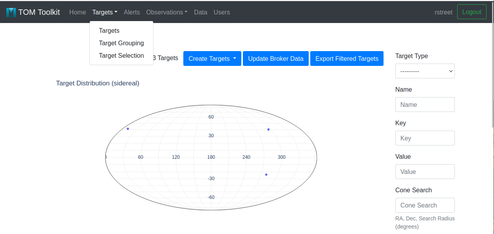
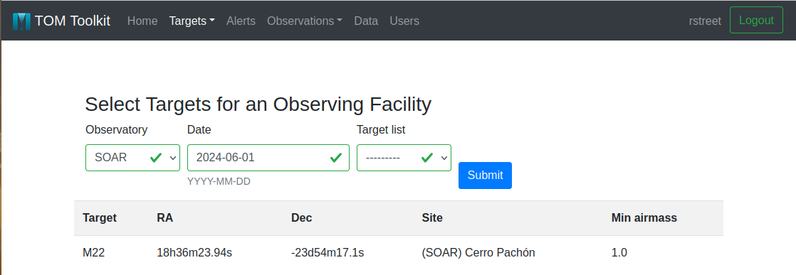
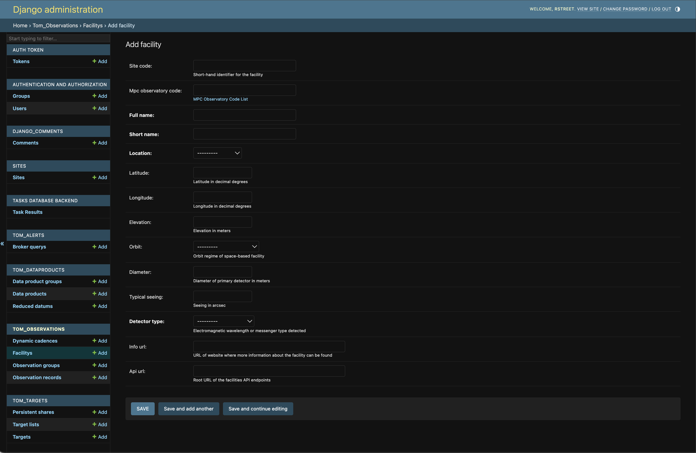

Selecting Targets for an Observing Facility
===========================================

During observing runs, particularly at manually- or remotely-operated telescope
facilities, it can often be very useful to display a selection of targets to be
observed on a particular night.  This needs to take into account target visibility from
the telescope site, as well as any prioritization of targets that the team have made.

TOMs provide support for this through the Target Selection option under the Target menu
in the main navigation bar.

Observers can select the telescope facility that they are observing from using the form
provided, indicating the date of the observing run.  The selected targets will be draw
from a predefined Target Grouping, which users can chose from the pulldown menu.

The TOM will evaluate the visibility of the selected sidereal targets for the telescope on the
night in question, and the resulting table will include all objects with a minimum
airmass less than 2.0.  Since this is computationally expensive, the visibility is calculated at intervals
of 10min for a 24hr period from the given start time.

Customizing the Selected Targets Table
~~~~~~~~~~~~~~~~~~~~~~~~~~~~~~~~~~~~~~

By default, this table will include the essential parameters necessary to point a
telescope at the target, but it can be easily extended to add further information
from a customized target model.

The columns of the table can be configured by editing the TOM's ``settings.py`` file,
and adding a list called ``SELECTION_EXTRA_FIELDS``, as shown in the example below.  The entries
in this list can be one or more of the exact names of attributes on your custom Target model.
``SELECTION_EXTRA_FIELDS`` can also include the names of methods on the custom Target model,
provided that they return output that can be rendered as a string entry in the table.
The list can be left empty if no additional fields should be added to the table.

.. code-block:: python

    # settings.py
    SELECTION_EXTRA_FIELDS = [
        'mag_now',
        'priority1',
        'priority2',
    ]

In this example, the custom Target model has fields named ``priority1``
and ``priority2`` and a method called ``mag_now``.   Adding those fields names to
the ``SELECTION_EXTRA_FIELDS`` list will cause three columns of the same names to appear
in the selected targets table output, containing the priority values and the calculated output of
the ``mag_now`` method.

Adding Facilities to the Observing Facilities Table
~~~~~~~~~~~~~~~~~~~~~~~~~~~~~~~~~~~~~~~~~~~~~~~~~~~

If you would like to record a telescope facility for the purposes of observation planning, but don't want to
add code for a new facility module, you can add it to the TOM's table of observing facilities.

Currently, this can be done by the TOM's administrator, by navigating to the TOM's built-in admin interface.
This page can be reached by adding ``/admin/`` to the end of the TOM's root URL in your browser's navigation bar, e.g.:

.. code-block:: html

    > https://demo.lco.global/admin/

Scrolling down the list of database tables, you will find ``Facilities`` under the tables from the ``tom_observations`` app.
Clicking on this link will take you to a list of telescopes recorded in the TOM's database.  Note that this list
is distinct (and does not include) telescopes already known to the TOM through installed facility modules.

You can record new telescopes to this table using the admin interface's ``Add Facility`` button; this will present you
with the following form:

Fill in the form and click ``save``. Now if you return to your TOM's usual interface, and navigate to the ``Target Selection``
page, the facility you added will appear in the list of facilities for which visibilities can be calculated.